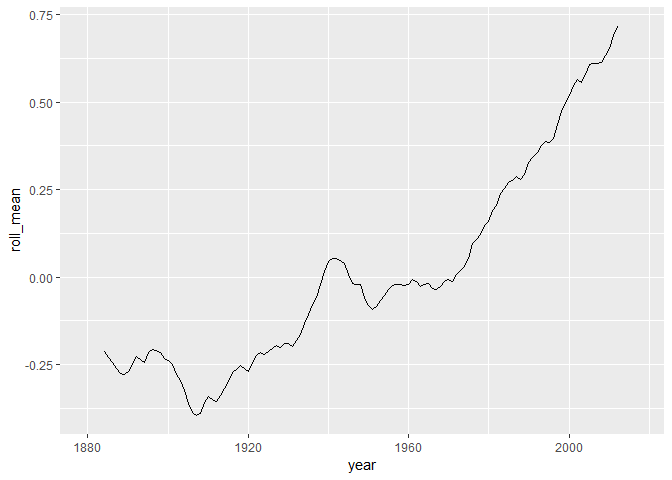

Climate Exercise
================
Carl Boettiger & Dana Seidel

Unit I: Climate Change Module
=============================

Warm-up exercise: Examining CO2 trends in R
-------------------------------------------

-   Example from <http://climate.nasa.gov/vital-signs/carbon-dioxide/>
-   Raw data from <ftp://aftp.cmdl.noaa.gov/products/trends/co2/co2_mm_mlo.txt>

``` r
library(tidyverse)
```

``` r
co2 <- 
readr::read_table("ftp://aftp.cmdl.noaa.gov/products/trends/co2/co2_mm_mlo.txt", 
                  comment="#",
                  col_names = c("year", "month", "decimal_date", "average",
                                "interpolated", "trend", "days"),
                  na = c("-1", "-99.99"))
co2
```

    ## # A tibble: 725 x 7
    ##     year month decimal_date average interpolated trend  days
    ##    <int> <int>        <dbl>   <dbl>        <dbl> <dbl> <int>
    ##  1  1958     3        1958.    316.         316.  315.    NA
    ##  2  1958     4        1958.    317.         317.  315.    NA
    ##  3  1958     5        1958.    318.         318.  315.    NA
    ##  4  1958     6        1958.     NA          317.  315.    NA
    ##  5  1958     7        1959.    316.         316.  315.    NA
    ##  6  1958     8        1959.    315.         315.  316.    NA
    ##  7  1958     9        1959.    313.         313.  316.    NA
    ##  8  1958    10        1959.     NA          313.  316.    NA
    ##  9  1958    11        1959.    313.         313.  315.    NA
    ## 10  1958    12        1959.    315.         315.  316.    NA
    ## # ... with 715 more rows

``` r
ggplot(co2, aes(x = decimal_date, y = average)) + geom_line() 
```


Which months are the CO2 values at the maximum? Minimum? Why is this? C02 values are at the maximum at the end of winter/start of summer (around May). C02 values are at the minimum at the end of summer/start of winter (around September). This trend is due to the periodicity of photosynthesis of plants.

What rolling average is used in computing the "trend" line? How does the trend depend on the rolling average? The rolling average used is monthly averages of C02 concentations in ppm. The trend depends on the rolling average because they are used to plot the y values.

------------------------------------------------------------------------

Exercise I: Temperature Data
============================

Each of the last years has consecutively set new records on global climate. In this section we will analyze global mean temperature data.

Data from: <http://climate.nasa.gov/vital-signs/global-temperature>

Question 1:
-----------

Describe the data set to the best of your ability given the documentation provided. Describe what kind of column each data contains and what units it is measured in. Then address our three key questions in understanding this data:

-   How are the measurements made? What is the associated measurement uncertainty? They are made through satellite imaging and temperature variation/average. The associated measurement uncertainty is data prior to this technology and the calculations used to find the average.

-   What is the resolution of the data? 1951-1980 averages

-   Are their missing values? How should they be handled? Yes data before 1951. Carbon isotopes in ice are used as an indicator for temperature. Change confidence intervals and other statistical methods.

Question 2:
-----------

Construct the necessary R code to import and prepare for manipulation the following data set: <http://climate.nasa.gov/system/internal_resources/details/original/647_Global_Temperature_Data_File.txt>

``` r
co2_index <- 
readr::read_tsv("http://climate.nasa.gov/system/internal_resources/details/original/647_Global_Temperature_Data_File.txt", 
                  comment="#",
                  col_names = c("year", "annual_mean", "lowess_smoothing"))
co2_index
```

    ## # A tibble: 138 x 3
    ##     year annual_mean lowess_smoothing
    ##    <int>       <dbl>            <dbl>
    ##  1  1880       -0.19            -0.11
    ##  2  1881       -0.1             -0.14
    ##  3  1882       -0.1             -0.17
    ##  4  1883       -0.19            -0.21
    ##  5  1884       -0.28            -0.24
    ##  6  1885       -0.31            -0.26
    ##  7  1886       -0.32            -0.27
    ##  8  1887       -0.35            -0.27
    ##  9  1888       -0.18            -0.27
    ## 10  1889       -0.11            -0.26
    ## # ... with 128 more rows

Question 3:
-----------

Plot the trend in global mean temperatures over time. Describe what you see in the plot and how you interpret the patterns you observe.

``` r
ggplot(co2_index, aes(x = year, y = annual_mean)) + geom_line() 
```

 Variation in temperature global averages from 1880-2018. General increase after 1945 with slight variations. Stablized average with natural variation before 1945.

Question 4: Evaluating the evidence for a "Pause" in warming?
-------------------------------------------------------------

The [2013 IPCC Report](https://www.ipcc.ch/pdf/assessment-report/ar5/wg1/WG1AR5_SummaryVolume_FINAL.pdf) included a tentative observation of a "much smaller increasing trend" in global mean temperatures since 1998 than was observed previously. This led to much discussion in the media about the existence of a "Pause" or "Hiatus" in global warming rates, as well as much research looking into where the extra heat could have gone. (Examples discussing this question include articles in [The Guardian](http://www.theguardian.com/environment/2015/jun/04/global-warming-hasnt-paused-study-finds), [BBC News](http://www.bbc.com/news/science-environment-28870988), and [Wikipedia](https://en.wikipedia.org/wiki/Global_warming_hiatus)).

By examining the data here, what evidence do you find or not find for such a pause? Present an analysis of this data (using the tools & methods we have covered in Foundation course so far) to argue your case.
We can disprove the 'pause' in global warming by overlaying data from natural weather and climactic events including El Nino, volcanic erruptions, and the ban on aersols including CFC's. If we compared models that included trends with and without the occurence of El Nino years, volcanic erruptions, and the continued effects of emmited aerosols the resuling 'pause' in climate change would be disproved.

What additional analyses or data sources would better help you refine your arguments? Showing long term temperature data overlayed with volcanic eruption, El Nino, and/or with/without the effects aerosols.

Question 5: Rolling averages
----------------------------

-   What is the meaning of "5 year average" vs "annual average"?
-   Construct 5 year averages from the annual data. Construct 10 & 20-year averages.
-   Plot the different averages and describe what differences you see and why.

``` r
library(zoo)
```

    ## 
    ## Attaching package: 'zoo'

    ## The following objects are masked from 'package:base':
    ## 
    ##     as.Date, as.Date.numeric

``` r
co2_index_5 <- co2_index %>% 
  mutate(roll_mean = rollmean(annual_mean, 5, na.pad = T))

co2_index_10 <- co2_index %>% 
  mutate(roll_mean = rollmean(annual_mean, 10, na.pad = T))

co2_index_20 <- co2_index %>% 
  mutate(roll_mean = rollmean(annual_mean, 20, na.pad = T))
```

``` r
ggplot(co2_index_5, aes(x = year, y = roll_mean)) + geom_line() 
```

    ## Warning: Removed 4 rows containing missing values (geom_path).


``` r
ggplot(co2_index_10, aes(x = year, y = roll_mean)) + geom_line() 
```

    ## Warning: Removed 9 rows containing missing values (geom_path).



``` r
ggplot(co2_index_20, aes(x = year, y = roll_mean)) + geom_line() 
```

    ## Warning: Removed 19 rows containing missing values (geom_path).

 \# Exercise II: Melting Ice Sheets?

-   Data description: <http://climate.nasa.gov/vital-signs/land-ice/>
-   Raw data file: <http://climate.nasa.gov/system/internal_resources/details/original/499_GRN_ANT_mass_changes.csv>

Question 1:
-----------

-   Describe the data set: what are the columns and units? Where do the numbers come from?
-   What is the uncertainty in measurment? Resolution of the data? Interpretation of missing values?

Question 2:
-----------

Construct the necessary R code to import this data set as a tidy `Table` object.

Question 3:
-----------

Plot the data and describe the trends you observe.

Exercise III: Rising Sea Levels?
================================

-   Data description: <http://climate.nasa.gov/vital-signs/sea-level/>
-   Raw data file: <http://climate.nasa.gov/system/internal_resources/details/original/121_Global_Sea_Level_Data_File.txt>

Question 1:
-----------

-   Describe the data set: what are the columns and units?
-   Where do these data come from?
-   What is the uncertainty in measurment? Resolution of the data? Interpretation of missing values?

Question 2:
-----------

Construct the necessary R code to import this data set as a tidy `Table` object.

Question 3:
-----------

Plot the data and describe the trends you observe.

Exercise IV: Arctic Sea Ice?
============================

-   <http://nsidc.org/data/G02135>
-   <ftp://sidads.colorado.edu/DATASETS/NOAA/G02135/north/daily/data/N_seaice_extent_daily_v3.0.csv>

Question 1:
-----------

-   Describe the data set: what are the columns and units?
-   Where do these data come from?
-   What is the uncertainty in measurement? Resolution of the data? Interpretation of missing values?

Question 2:
-----------

Construct the necessary R code to import this data set as a tidy `Table` object.

Question 3:
-----------

Plot the data and describe the trends you observe.

Exercise V: Longer term trends in CO2 Records
=============================================

The data we analyzed in the unit introduction included CO2 records dating back only as far as the measurements at the Manua Loa observatory. To put these values into geological perspective requires looking back much farther than humans have been monitoring atmosopheric CO2 levels. To do this, we need another approach.

[Ice core data](http://cdiac.ornl.gov/trends/co2/ice_core_co2.html):

Vostok Core, back to 400,000 yrs before present day

-   Description of data set: <http://cdiac.esd.ornl.gov/trends/co2/vostok.html>
-   Data source: <http://cdiac.ornl.gov/ftp/trends/co2/vostok.icecore.co2>

Questions / Tasks:
------------------

-   Describe the data set: what are the columns and units? Where do the numbers come from?
-   What is the uncertainty in measurment? Resolution of the data? Interpretation of missing values?
-   Read in and prepare data for analysis.
-   Reverse the ordering to create a chronological record.
-   Plot data
-   Consider various smoothing windowed averages of the data.
-   Join this series to Mauna Loa data
-   Plot joined data
-   Describe your conclusions
