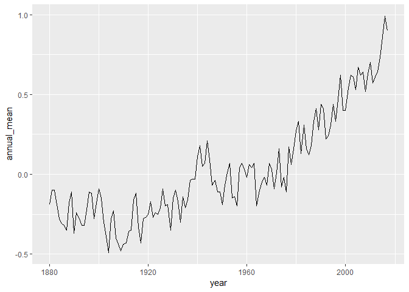

Climate Exercise
================
Change to your own names

Unit I: Climate Change Module
=============================

Warm-up exercise: Examining CO2 trends in R
-------------------------------------------

-   Example from <http://climate.nasa.gov/vital-signs/carbon-dioxide/>
-   Raw data from <ftp://aftp.cmdl.noaa.gov/products/trends/co2/co2_mm_mlo.txt>

``` r
library(tidyverse)
library(RcppRoll) # remember to install RcppRoll package 
library(lubridate)
```

``` r
co2 <- 
readr::read_table("ftp://aftp.cmdl.noaa.gov/products/trends/co2/co2_mm_mlo.txt", 
                  comment="#",
                  col_names = c("year", "month", "decimal_date", "average",
                                "interpolated", "trend", "days"),
                  na = c("-1", "-99.99"))
co2
```

    ## # A tibble: 726 x 7
    ##     year month decimal_date average interpolated trend  days
    ##    <int> <int>        <dbl>   <dbl>        <dbl> <dbl> <int>
    ##  1  1958     3        1958.    316.         316.  315.    NA
    ##  2  1958     4        1958.    317.         317.  315.    NA
    ##  3  1958     5        1958.    318.         318.  315.    NA
    ##  4  1958     6        1958.     NA          317.  315.    NA
    ##  5  1958     7        1959.    316.         316.  315.    NA
    ##  6  1958     8        1959.    315.         315.  316.    NA
    ##  7  1958     9        1959.    313.         313.  316.    NA
    ##  8  1958    10        1959.     NA          313.  316.    NA
    ##  9  1958    11        1959.    313.         313.  315.    NA
    ## 10  1958    12        1959.    315.         315.  316.    NA
    ## # ... with 716 more rows

``` r
ggplot(co2, aes(x = decimal_date, y = average)) + geom_line() 
```


Which months are the CO2 values at the maximum? Minimum? Why is this? C02 values are at the maximum at the end of winter/start of summer (around May). C02 values are at the minimum at the end of summer/start of winter (around September). This trend is due to the periodicity of photosynthesis of plants.

What rolling average is used in computing the "trend" line? How does the trend depend on the rolling average? The rolling average used is monthly averages of C02 concentations in ppm. The trend depends on the rolling average because they are used to plot the y values.

------------------------------------------------------------------------

Exercise I: Temperature Data
============================

Each of the last years has consecutively set new records on global climate. In this section we will analyze global mean temperature data.

Data from: <http://climate.nasa.gov/vital-signs/global-temperature>

Question 1:
-----------

Describe the data set to the best of your ability given the documentation provided. Describe what kind of column each data contains and what units it is measured in. Then address our three key questions in understanding this data:

-   How are the measurements made? What is the associated measurement uncertainty? They are made through satellite imaging and temperature variation/average. The associated measurement uncertainty is data prior to this technology and the calculations used to find the average.

-   What is the resolution of the data? 1951-1980 averages

-   Are their missing values? How should they be handled? Yes data before 1951. Carbon isotopes in ice are used as an indicator for temperature. Change confidence intervals and other statistical methods.

Question 2:
-----------

Construct the necessary R code to import and prepare for manipulation the following data set: <http://climate.nasa.gov/system/internal_resources/details/original/647_Global_Temperature_Data_File.txt>

``` r
co2_index <- 
readr::read_tsv("http://climate.nasa.gov/system/internal_resources/details/original/647_Global_Temperature_Data_File.txt", 
                  comment="#",
                  col_names = c("year", "annual_mean", "lowess_smoothing"))
co2_index
```

    ## # A tibble: 138 x 3
    ##     year annual_mean lowess_smoothing
    ##    <int>       <dbl>            <dbl>
    ##  1  1880       -0.19            -0.11
    ##  2  1881       -0.1             -0.14
    ##  3  1882       -0.1             -0.17
    ##  4  1883       -0.19            -0.21
    ##  5  1884       -0.28            -0.24
    ##  6  1885       -0.31            -0.26
    ##  7  1886       -0.32            -0.27
    ##  8  1887       -0.35            -0.27
    ##  9  1888       -0.18            -0.27
    ## 10  1889       -0.11            -0.26
    ## # ... with 128 more rows

Question 3:
-----------

Plot the trend in global mean temperatures over time. Describe what you see in the plot and how you interpret the patterns you observe.

``` r
ggplot(co2_index, aes(x = year, y = annual_mean)) + geom_line() 
```

 Variation in temperature global averages from 1880-2018. General increase after 1945 with slight variations. Stablized average with natural variation before 1945.

Question 4: Evaluating the evidence for a "Pause" in warming?
-------------------------------------------------------------

The [2013 IPCC Report](https://www.ipcc.ch/pdf/assessment-report/ar5/wg1/WG1AR5_SummaryVolume_FINAL.pdf) included a tentative observation of a "much smaller increasing trend" in global mean temperatures since 1998 than was observed previously. This led to much discussion in the media about the existence of a "Pause" or "Hiatus" in global warming rates, as well as much research looking into where the extra heat could have gone. (Examples discussing this question include articles in [The Guardian](http://www.theguardian.com/environment/2015/jun/04/global-warming-hasnt-paused-study-finds), [BBC News](http://www.bbc.com/news/science-environment-28870988), and [Wikipedia](https://en.wikipedia.org/wiki/Global_warming_hiatus)).

By examining the data here, what evidence do you find or not find for such a pause? Present an analysis of this data (using the tools & methods we have covered in Foundation course so far) to argue your case.
We can disprove the 'pause' in global warming by overlaying data from natural weather and climactic events including El Nino, volcanic erruptions, and the ban on aersols including CFC's. If we compared models that included trends with and without the occurence of El Nino years, volcanic erruptions, and the continued effects of emmited aerosols the resuling 'pause' in climate change would be disproved.

What additional analyses or data sources would better help you refine your arguments? Showing long term temperature data overlayed with volcanic eruption, El Nino, and/or with/without the effects aerosols.

Question 5: Rolling averages
----------------------------

-   What is the meaning of "5 year average" vs "annual average"?
-   Construct 5 year averages from the annual data. Construct 10 & 20-year averages.
-   Plot the different averages and describe what differences you see and why.

``` r
co2_index_5 <- co2_index %>% 
  mutate(roll_mean = roll_mean(x = annual_mean, n = 5, fill = NA))

co2_index_10 <- co2_index %>% 
  mutate(roll_mean = roll_mean(x = annual_mean, n = 10, fill = NA))

co2_index_20 <- co2_index %>% 
  mutate(roll_mean = roll_mean(x = annual_mean, n = 20, fill = NA))
```

``` r
ggplot(co2_index_5, aes(x = year, y = roll_mean)) + geom_line() 
```

    ## Warning: Removed 4 rows containing missing values (geom_path).


``` r
ggplot(co2_index_10, aes(x = year, y = roll_mean)) + geom_line() 
```

    ## Warning: Removed 9 rows containing missing values (geom_path).


``` r
ggplot(co2_index_20, aes(x = year, y = roll_mean)) + geom_line() 
```

    ## Warning: Removed 19 rows containing missing values (geom_path).

 They get smoother.

Exercise II: Melting Ice Sheets?
================================

-   Data description: <http://climate.nasa.gov/vital-signs/land-ice/>
-   Raw data file: <http://climate.nasa.gov/system/internal_resources/details/original/499_GRN_ANT_mass_changes.csv>

Question 1:
-----------

-   Describe the data set: what are the columns and units? Where do the numbers come from? The data set gives the mass change of the Greenland and Antartica ice sheets beginning in 2002 through 2009. The columns are time, change in Greenland ice mass, and change in Antartica ice mass given in Gt/year. This data comes from the GRACE satelitte
-   What is the uncertainty in measurment? Resolution of the data? Interpretation of missing values? The resolution of the data is 2002-2009 and uncertainty in measurement comes from the calculated mean calculated average for the time series. For this resoultion,there is no missing data

Question 2:
-----------

Construct the necessary R code to import this data set as a tidy `Table` object.

``` r
ice_sheets <- 
readr::read_csv("http://climate.nasa.gov/system/internal_resources/details/original/499_GRN_ANT_mass_changes.csv", 
                  skip = 10,
                  col_names = c("time", "a1_mass", "a2_mass"))
```

    ## Parsed with column specification:
    ## cols(
    ##   time = col_double(),
    ##   a1_mass = col_double(),
    ##   a2_mass = col_double()
    ## )

``` r
ice_sheets
```

    ## # A tibble: 140 x 3
    ##     time a1_mass a2_mass
    ##    <dbl>   <dbl>   <dbl>
    ##  1 2002.   1491.    967.
    ##  2 2002.   1486.    979.
    ##  3 2003.   1287.    512.
    ##  4 2003.   1258.    859.
    ##  5 2003.   1257.    694.
    ##  6 2003.   1288.    592.
    ##  7 2003.   1337.    658.
    ##  8 2003.   1354.    477.
    ##  9 2003.   1363.    546.
    ## 10 2003.   1427.    494.
    ## # ... with 130 more rows

Question 3:
-----------

Plot the data and describe the trends you observe.

``` r
#Plot the data and describe the trends you observe.
ggplot(ice_sheets, aes(x=time)) + geom_line(aes(y=a1_mass, color='a1')) + geom_line(aes(y=a2_mass))
```

 Greenland is decreasing at a greater rate than Antarctica

Exercise III: Rising Sea Levels?
================================

-   Data description: <http://climate.nasa.gov/vital-signs/sea-level/>
-   Raw data file: <http://climate.nasa.gov/system/internal_resources/details/original/121_Global_Sea_Level_Data_File.txt>

Question 1:
-----------

-   Describe the data set: what are the columns and units?
-   Where do these data come from?
-   What is the uncertainty in measurment? Resolution of the data? Interpretation of missing values?

1.  altimeter type 0=dual-frequency 999=single frequency (ie Poseidon-1)
2.  merged file cycle \#
3.  year+fraction of year (mid-cycle)
4.  number of observations
5.  number of weighted observations
6.  GMSL (Global Isostatic Adjustment (GIA) not applied) variation (mm) with respect to TOPEX 7. collinear mean reference
7.  standard deviation of GMSL (GIA not applied) variation estimate (mm)
8.  smoothed (60-day 8. Gaussian type filter) GMSL (GIA not applied) variation (mm)
9.  GMSL (Global Isostatic Adjustment (GIA) applied) variation (mm) with respect to TOPEX collinear mean reference
10. standard deviation of GMSL (GIA applied) variation estimate (mm)
11. smoothed (60-day Gaussian type filter) GMSL (GIA applied) variation (mm)
12. smoothed (60-day Gaussian type filter) GMSL (GIA applied) variation (mm); annual and semi-annual signal removed

Data comes from NASA, coastal tide gauge data, satellite. Uncertainty in mean references, variation in mm of sea levels per year. 1993 - 2016 resolution. None.

Question 2:
-----------

Construct the necessary R code to import this data set as a tidy `Table` object.

``` r
sea_level <- 
readr::read_table2("http://climate.nasa.gov/system/internal_resources/details/original/121_Global_Sea_Level_Data_File.txt",
                  skip = 47,
                  col_names = c("alimeter type", "merged file cycle", "year_fraction_year", "No. observ", "No. weighted observ", "GMSL", "SD GMSL", "GMSL_variation", "SD GMSL variation", "smoothed GMSL var", "smooth GMSL variation w/o yearly signal"))
```

    ## Parsed with column specification:
    ## cols(
    ##   `alimeter type` = col_integer(),
    ##   `merged file cycle` = col_integer(),
    ##   year_fraction_year = col_double(),
    ##   `No. observ` = col_integer(),
    ##   `No. weighted observ` = col_double(),
    ##   GMSL = col_double(),
    ##   `SD GMSL` = col_double(),
    ##   GMSL_variation = col_double(),
    ##   `SD GMSL variation` = col_double(),
    ##   `smoothed GMSL var` = col_double(),
    ##   `smooth GMSL variation w/o yearly signal` = col_double()
    ## )

    ## Warning in rbind(names(probs), probs_f): number of columns of result is not
    ## a multiple of vector length (arg 1)

    ## Warning: 847 parsing failures.
    ## row # A tibble: 5 x 5 col     row col   expected   actual   file                                     expected   <int> <chr> <chr>      <chr>    <chr>                                    actual 1     1 <NA>  11 columns 12 colu~ 'http://climate.nasa.gov/system/interna~ file 2     2 <NA>  11 columns 12 colu~ 'http://climate.nasa.gov/system/interna~ row 3     3 <NA>  11 columns 12 colu~ 'http://climate.nasa.gov/system/interna~ col 4     4 <NA>  11 columns 12 colu~ 'http://climate.nasa.gov/system/interna~ expected 5     5 <NA>  11 columns 12 colu~ 'http://climate.nasa.gov/system/interna~
    ## ... ................. ... .......................................................................... ........ .......................................................................... ...... .......................................................................... .... .......................................................................... ... .......................................................................... ... .......................................................................... ........ ..........................................................................
    ## See problems(...) for more details.

``` r
sea_level
```

    ## # A tibble: 847 x 11
    ##    `alimeter type` `merged file cy~ year_fraction_y~ `No. observ`
    ##              <int>            <int>            <dbl>        <int>
    ##  1               0               11            1993.       463892
    ##  2               0               12            1993.       458154
    ##  3               0               13            1993.       469524
    ##  4               0               14            1993.       419112
    ##  5               0               15            1993.       456793
    ##  6               0               16            1993.       414055
    ##  7               0               17            1993.       465235
    ##  8               0               18            1993.       463257
    ##  9               0               19            1993.       458542
    ## 10             999               20            1993.       464921
    ## # ... with 837 more rows, and 7 more variables: `No. weighted
    ## #   observ` <dbl>, GMSL <dbl>, `SD GMSL` <dbl>, GMSL_variation <dbl>, `SD
    ## #   GMSL variation` <dbl>, `smoothed GMSL var` <dbl>, `smooth GMSL
    ## #   variation w/o yearly signal` <dbl>

Question 3:
-----------

Plot the data and describe the trends you observe.

``` r
#Plot the data and describe the trends you observe.
ggplot(sea_level, aes(x=year_fraction_year)) + geom_line(aes(y=GMSL)) + geom_line(aes(y=GMSL_variation, col='red'))
```

 The data shows that mean sea level has increased since 1993

Exercise IV: Arctic Sea Ice?
============================

-   <http://nsidc.org/data/G02135>
-   <ftp://sidads.colorado.edu/DATASETS/NOAA/G02135/north/daily/data/N_seaice_extent_daily_v3.0.csv>

Question 1:
-----------

-   Describe the data set: what are the columns and units?

The columns are Year, Month, Day, Extent, Missing, Source Data

-   Where do these data come from? NOAA and the National Snow and Ice Data center. Data was collected using sensors

-   What is the uncertainty in measurement? Resolution of the data? Interpretation of missing values?

Spatial Resolution is 25km x 25km Temporal Resolution 1 day, 1 month

Question 2:
-----------

Construct the necessary R code to import this data set as a tidy `Table` object.

``` r
ice_level <- 
readr::read_csv("ftp://sidads.colorado.edu/DATASETS/NOAA/G02135/north/daily/data/N_seaice_extent_daily_v3.0.csv",
                skip=2,
                  col_names = c("year", "month", "day", "extent_sq_km", "missing", "source"))
```

    ## Parsed with column specification:
    ## cols(
    ##   year = col_integer(),
    ##   month = col_character(),
    ##   day = col_character(),
    ##   extent_sq_km = col_double(),
    ##   missing = col_double(),
    ##   source = col_character()
    ## )

``` r
ice_level
```

    ## # A tibble: 12,917 x 6
    ##     year month day   extent_sq_km missing source                          
    ##    <int> <chr> <chr>        <dbl>   <dbl> <chr>                           
    ##  1  1978 10    26            10.2       0 ['ftp://sidads.colorado.edu/pub~
    ##  2  1978 10    28            10.4       0 ['ftp://sidads.colorado.edu/pub~
    ##  3  1978 10    30            10.6       0 ['ftp://sidads.colorado.edu/pub~
    ##  4  1978 11    01            10.7       0 ['ftp://sidads.colorado.edu/pub~
    ##  5  1978 11    03            10.8       0 ['ftp://sidads.colorado.edu/pub~
    ##  6  1978 11    05            11.0       0 ['ftp://sidads.colorado.edu/pub~
    ##  7  1978 11    07            11.1       0 ['ftp://sidads.colorado.edu/pub~
    ##  8  1978 11    09            11.2       0 ['ftp://sidads.colorado.edu/pub~
    ##  9  1978 11    11            11.3       0 ['ftp://sidads.colorado.edu/pub~
    ## 10  1978 11    13            11.5       0 ['ftp://sidads.colorado.edu/pub~
    ## # ... with 12,907 more rows

Question 3:
-----------

Plot the data and describe the trends you observe.

``` r
library(lubridate)

ice_level <- mutate(ice_level, date = as.Date(with(ice_level, paste(year, month, day,sep="-")), "%Y-%m-%d"))
ggplot(ice_level, aes(x=date, y=extent_sq_km)) + geom_line()
```

 We observe seasonal variation and an overall decrease in Arctic sea ice extent since 1978 \# Exercise V: Longer term trends in CO2 Records

The data we analyzed in the unit introduction included CO2 records dating back only as far as the measurements at the Manua Loa observatory. To put these values into geological perspective requires looking back much farther than humans have been monitoring atmosopheric CO2 levels. To do this, we need another approach.

[Ice core data](http://cdiac.ornl.gov/trends/co2/ice_core_co2.html):

Vostok Core, back to 400,000 yrs before present day

-   Description of data set: <http://cdiac.esd.ornl.gov/trends/co2/vostok.html>
-   Data source: <http://cdiac.ornl.gov/ftp/trends/co2/vostok.icecore.co2>

Questions / Tasks:
------------------

-   Describe the data set: what are the columns and units? Where do the numbers come from? The column are depth in meters, age of the ice in years before present, mean age of the air in years before present, and CO2 concentration in parts per million volume. The data comes from ice cores of East Antarctica. Ice was crushed and a historical record of co2 concentration stored in the ice gives the data
-   What is the uncertainty in measurment? Resolution of the data? Interpretation of missing values? Missing values- N/A. The temporal resoultion of the data is 417160 to 2342 years before present. Data was collected from the east Antarctica ice core.

-   Read in and prepare data for analysis.

``` r
longtcarbon <- 
readr::read_table2("http://cdiac.ornl.gov/ftp/trends/co2/vostok.icecore.co2",
                skip=21,
                  col_names = c("depth", "age_ice", "age_air", "co2_concentration"))
```

    ## Parsed with column specification:
    ## cols(
    ##   depth = col_double(),
    ##   age_ice = col_integer(),
    ##   age_air = col_integer(),
    ##   co2_concentration = col_double()
    ## )

``` r
longtcarbon
```

    ## # A tibble: 363 x 4
    ##    depth age_ice age_air co2_concentration
    ##    <dbl>   <int>   <int>             <dbl>
    ##  1  149.    5679    2342              285.
    ##  2  173.    6828    3634              273.
    ##  3  177.    7043    3833              268.
    ##  4  229.    9523    6220              262.
    ##  5  250.   10579    7327              255.
    ##  6  266    11334    8113              260.
    ##  7  303.   13449   10123              262.
    ##  8  321.   14538   11013              264.
    ##  9  332.   15208   11326              245.
    ## 10  342.   15922   11719              238.
    ## # ... with 353 more rows

-   Reverse the ordering to create a chronological record.

-   Plot data

``` r
ggplot(longtcarbon, aes(x=desc(age_ice), y=co2_concentration)) + geom_line()
```

 - Consider various smoothing windowed averages of the data.

``` r
ggplot(data = longtcarbon) +
  geom_smooth(aes(x = desc(age_ice), y=co2_concentration))
```

    ## `geom_smooth()` using method = 'loess' and formula 'y ~ x'

 - Join this series to Mauna Loa data

``` r
co2_index # remember to finish this code chunk
```

    ## # A tibble: 138 x 3
    ##     year annual_mean lowess_smoothing
    ##    <int>       <dbl>            <dbl>
    ##  1  1880       -0.19            -0.11
    ##  2  1881       -0.1             -0.14
    ##  3  1882       -0.1             -0.17
    ##  4  1883       -0.19            -0.21
    ##  5  1884       -0.28            -0.24
    ##  6  1885       -0.31            -0.26
    ##  7  1886       -0.32            -0.27
    ##  8  1887       -0.35            -0.27
    ##  9  1888       -0.18            -0.27
    ## 10  1889       -0.11            -0.26
    ## # ... with 128 more rows

-   Plot joined data
-   Describe your conclusions
